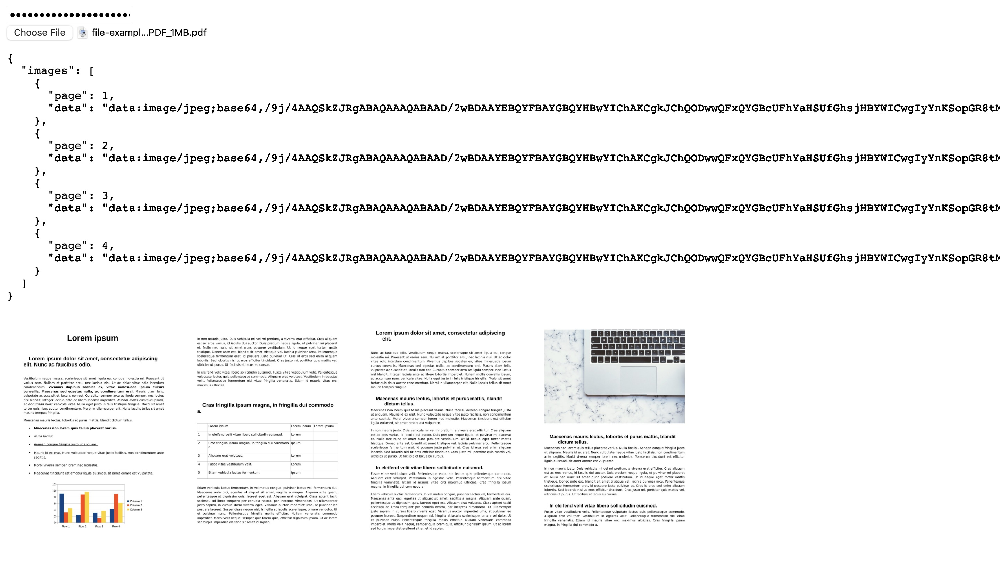

# PDF to Images

A tool to parse PDF files and extract images. This is useful to pass to LLMs that require images.

## Example for OpenAI o1

```javascript
// Convert PDF to images
const response = await fetch('/api/convert', {
  method: 'POST',
  headers: {
    'Content-Type': 'application/json',
    'x-api-key': 'your-api-key'
  },
  body: JSON.stringify({ pdf: base64PdfContent })
});

const { images } = await response.json();

// Create OpenAI message with images
const messages = [
  {
    role: 'user',
    content: [
      { type: 'text', text: 'Summarize this PDF' },
      ...images.map(img => ({
        type: 'image_url',
        image_url: { url: img.data }
      }))
    ]
  }
];
```

## Getting Started

1. Create a `.env.local` file:
The API is protected by an API key defined in an enviorment variable, you can set it to anything you want.

```bash
API_KEY=your-secret-key-here
```

2. Run the development server:
```bash
npm run dev
```

## Testing

Visit the homepage to test PDF conversion using a simple upload interface:



This provides a quick way to verify that PDFs are being properly converted to images.

## API Usage

The API supports two ways to send PDFs:

### 1. JSON with Base64
```javascript
// JavaScript/TypeScript
const base64 = await new Promise((resolve, reject) => {
  const reader = new FileReader();
  reader.readAsArrayBuffer(file);
  reader.onload = () => {
    const buffer = Buffer.from(reader.result as ArrayBuffer);
    resolve(buffer.toString('base64'));
  };
  reader.onerror = reject;
});

const response = await fetch('/api/convert', {
  method: 'POST',
  headers: {
    'Content-Type': 'application/json',
    'x-api-key': 'your-api-key'
  },
  body: JSON.stringify({ pdf: base64 })
});
```

```bash
# curl
curl -X POST \
  -H "Content-Type: application/json" \
  -H "x-api-key: your-secret-key-here" \
  -d "{\"pdf\":\"$(base64 -i input.pdf)\"}" \
  http://localhost:3000/api/convert
```

### 2. Raw PDF
```javascript
// JavaScript/TypeScript
const formData = new FormData();
formData.append('pdf', file);

const response = await fetch('/api/convert', {
  method: 'POST',
  headers: {
    'Content-Type': 'application/pdf',
    'x-api-key': 'your-api-key'
  },
  body: file
});
```

```bash
# curl
curl -X POST \
  -H "Content-Type: application/pdf" \
  -H "x-api-key: your-secret-key-here" \
  --data-binary @input.pdf \
  http://localhost:3000/api/convert
```

Both methods return the same response format with converted images.
